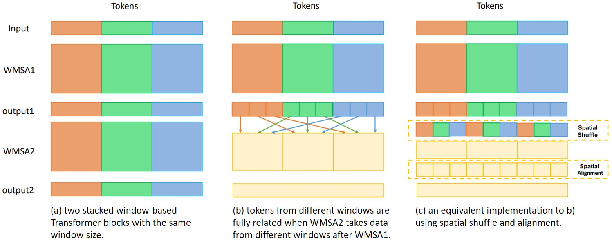

# Shuffle Transformer

The implementation of "[Shuffle Transformer: Rethinking Spatial Shuffle for Vision Transformer](https://arxiv.org/abs/2106.03650)"

## Introduction

Very recently, window-based Transformers, which computed self-attention within non-overlapping local windows, demonstrated promising results on image classification, semantic segmentation, and object detection. However, less study has been devoted to the cross-window connection which is the key element to improve the representation ability. **Shuffle Transformer** revisit the spatial shuffle as an efficient way to build connections among windows, which is highly efficient and easy to implement by modifying two lines of code. Furthermore, the depth-wise convolution is introduced to complement the spatial shuffle for enhancing neighbor-window connections. The proposed architectures achieve excellent performance on a wide range of visual tasks including image-level classification, object detection, and semantic segmentation.



## Requirements

- PyTorch==1.7.1
- torchvision==0.8.2
- timm==0.3.2

The [Apex](https://github.com/NVIDIA/apex) is optional for faster training speed. 

```
git clone https://github.com/NVIDIA/apex
cd apex
pip install -v --disable-pip-version-check --no-cache-dir --global-option="--cpp_ext" --global-option="--cuda_ext" ./
```

Other Requirements

```
pip install opencv-python==4.4.0.46 termcolor==1.1.0 yacs==0.1.8
pip install einops
```

## Main Results

##### Results on **ImageNet-1K**

| name      | acc@1 | #params | FLOPs | Throughputs(Images/s) | Weights                                                      |
| --------- | ----- | ------- | ----- | --------------------- | ------------------------------------------------------------ |
| Shuffle-T | 82.4  | 28M     | 4.6G  | 791                   | [google drive](https://drive.google.com/drive/folders/1goDJtcnxgBAcHhZnNwrgOlG_WBftpmOS?usp=sharing) |
| Shuffle-S | 83.6  | 50M     | 8.9G  | 450                   | [google drive](https://drive.google.com/drive/folders/1GUBBQyDldY145vDiK-BHqivmpj3K6HK2?usp=sharing) |
| Shuffle-B | 84.0  | 88M     | 15.6  | 279                   | [google drive](https://drive.google.com/drive/folders/1x0biaJRdN4nxLmp_3lQcA_6hO_sDBoUM?usp=sharing) |

## Usage

For classification on ImageNet-1K, to train from scratch, run:

```
python -m torch.distributed.launch --nproc_per_node <num-of-gpus-to-use>  main.py \ 
--cfg <config-file> --data-path <imagenet-path> [--batch-size <batch-size-per-gpu> --output <output-directory>]
```

To evaluate, run:

```
python -m torch.distributed.launch --nproc_per_node <num-of-gpus-to-use> main.py --eval \
--cfg <config-file> --resume <checkpoint> --data-path <imagenet-path> 
```

## In progress

- Semantic Segmentation
- Instance Segmentation


## Citing Shuffle Transformer

```
@article{huang2021shuffle,
 title={Shuffle Transformer: Rethinking Spatial Shuffle for Vision Transformer},
 author={Huang, Zilong and Ben, Youcheng and Luo, Guozhong and Cheng, Pei and Yu, Gang and Fu, Bin},
 journal={arXiv preprint arXiv:2106.03650},
 year={2021}
}
```

## Acknowledgement

Thanks to open-source implementation of [Swin-Transformer](https://github.com/microsoft/Swin-Transformer).

